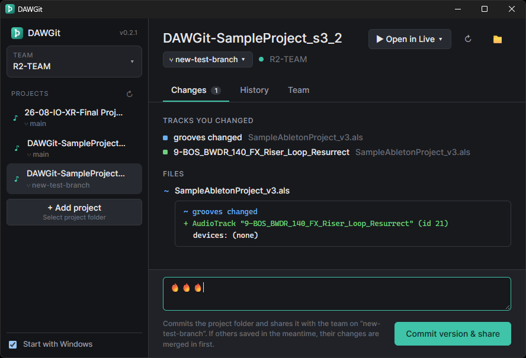

# DAWGit

[English](README.md) | **繁體中文**

Ableton Live 專案的版本紀錄與團隊協作工具。為你的歌曲保存版本、逐軌看出改了什麼，並和團員一起編輯同一首歌：DAWGit 會以音軌為單位合併大家的修改。

> **開發中（WIP）。** DAWGit 目前是早期預覽版，1.0 之前可能還有不少粗糙之處與變動（包括資料的儲存方式）。重要的專案請自行另外備份。目前只支援 Windows，已在 Ableton Live 12 上測試。

## 特色

- **整個專案的版本** — Live Set 與取樣音檔一起保存，每個版本附上說明。沒有變動的檔案只會存一份。
- **逐軌顯示變更** — 在 Live 按下 Ctrl+S 後，DAWGit 會列出你新增、刪除或修改了哪些音軌。
- **以音軌為單位合併** — 兩個人編輯同一首歌時，修改會逐軌合併（音軌本身、位置與順序、Send），也包括全曲層級的部分，例如 Main 音軌、Locator 與 Scene。只有在你們改到同一條音軌時，DAWGit 才會詢問要保留哪一邊：你的、對方的，或兩者並存。
- **取樣跟著專案走** — 專案資料夾內的取樣，以及放在硬碟其他位置的取樣，都會隨版本一起保存。在團員的電腦上，Set 會自動指向這些檔案。Live Pack 裡的取樣只記錄名稱。
- **知道誰在改什麼** — DAWGit 會顯示團員目前正在編輯哪些音軌，當你們同時改到同一條時會提醒你。你尚未存成版本的工作也會備份到團隊。
- **兩種架設團隊的方式**
  - 在團隊中任一台電腦或 NAS 上執行 **Team Server**（單一程式，不需額外設定），或
  - 使用 **S3 相容儲存空間**，例如 Cloudflare R2：不需要任何電腦保持開機。
- **也可以只在本機使用** — 自己一個人用，版本只存在你的電腦上。
- **不會偷偷改你的檔案** — 只有在你接收團隊的修改時，DAWGit 才會變動專案檔案，而且改寫 Set 之前會請你先關閉 Live。
- **分支（Branch）**，適合想分頭嘗試點子、之後再合併的團隊。

## 開始使用

### 安裝

1. 從 [Releases](../../releases) 頁面下載 `DAWGit-<版本>-setup.exe`。
2. 執行安裝檔，不需要系統管理員權限。安裝檔目前還沒有程式碼簽章，Windows 可能會顯示「Windows 已保護您的電腦」：請點 **其他資訊 → 仍要執行**。
3. 建議保持勾選 **Start with Windows**：DAWGit 會在系統匣待命，備份你進行中的工作，並在有新版本時通知你。

需要 Windows 10（21H2 以上）或 Windows 11。

### 自己一個人使用

1. 開啟 DAWGit，選擇 **Just keep versions on this computer**。
2. 選擇一個 Ableton 專案資料夾（裡面有 `.als` 檔和 `Ableton Project Info` 的那個）。
3. 照常在 Live 裡工作並按 **Ctrl+S**，變更就會出現在 DAWGit。
4. 描述你做了什麼，按 **Commit version**。

之後隨時可以用 **Share with a team…** 把專案分享給團隊。

### 加入團隊

向架設團隊的人索取 **Server 位址與 Token**，或你的 **Connection code**。

1. 開啟 DAWGit，貼上位址與 Token（或 Connection code），按 **Connect**。
2. 輸入你的名字，它會顯示在你保存的版本旁邊。
3. 下載你要參與的歌曲，或用 **+ Add a project** 加入你自己的專案。

日常使用：

- 在 Live 裡工作並按 **Ctrl+S**，變更會以音軌為單位出現在 **Changes**。
- 做到值得分享的段落時，描述一下並按 **Commit version & share**。如果期間團員也保存了版本，會先把他們的修改合併進來。
- 團員保存新版本時 DAWGit 會通知你。按 **Preview** 看改了什麼，按 **Get updates** 套用。請先在 Live 關閉該 Set，完成後再重新開啟。
- 出現黃色提示代表你和團員正在編輯同一條音軌：保存之前先溝通一下。

### 架設團隊

由一個人設定一次即可，二選一：

- **Team Server** — 在工作時會開著的電腦（或 NAS）上：開始選單 → **DAWGit → DAWGit Team Server**。視窗會顯示要分享給團員的位址與 Token。不在同一個網路的團員需要 VPN（例如 Tailscale）或設定連接埠轉送。
- **團隊儲存空間** — 建立一個 S3 相容的 bucket（例如 Cloudflare R2），為每位成員建立存取金鑰，再用 `dawgit connection-code` 為每個人產生 Connection code。不需要任何電腦保持開機。

詳細步驟請見 [docs/team-setup.md](docs/team-setup.md)（英文）。

## 目前的限制

- 只支援 Windows，macOS 版在規劃中。
- 已在 Ableton Live 12（12.3）上測試，其他版本或許可用，但尚未驗證。
- 有些外掛即使沒被動過，也會儲存變動的內部狀態，可能讓該音軌顯示為有變更或產生衝突。
- 還原到舊版本目前只能用[命令列工具](docs/cli.md)（`dawgit checkout`）。
- 團隊儲存空間中已刪除的專案與舊資料尚不會清理，用量只增不減。
- 沒有自動更新：新版請到 Releases 頁面下載。

## 更多資訊

- [團隊架設指南](docs/team-setup.md)（英文）
- [命令列工具](docs/cli.md)（英文）
- [建置與開發](docs/development.md)（英文）

歡迎在 [Issues](../../issues) 回報問題或提供意見。

## 授權

[MIT](LICENSE)
